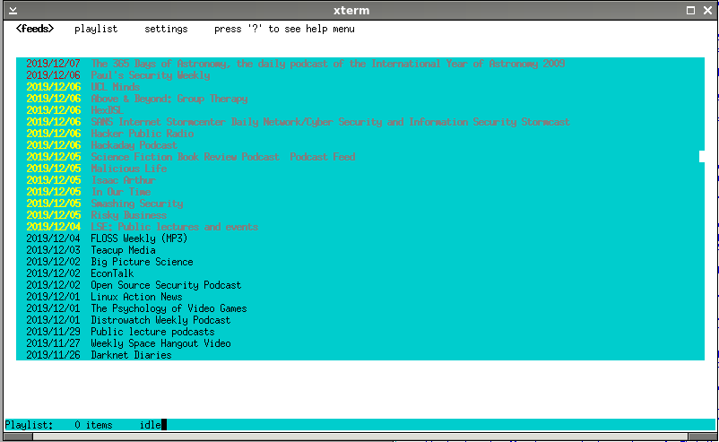

SYNOPSIS
========

castclient.lua is a primitive RSS Feed reader/webradio player that can download and play podcasts, bitchute videos and webradio streams. It's written in lua and requires libUseful and libUseful-lua to be installed. It uses an external program to play downloaded media, and currently searches for mpg123, mpg321, ogg123, madplay, sox play, mplayer or cxine to use for this. All these playback programs can be paused by castclient.lua, as it sends them the 'SIGSTOP' and 'SIGCONT' signals. Most of them also have rewind and fast-forward functionality.

castclient.lua is not (yet) a podcatcher, and can thus only play items that are currently in an RSS feed file. It downloads them when the user requests to play them.


LICENSE
=======

castclient.lua is released under the GPLv3 and is copyright Colum Paget 2019


USAGE
=====

castclient.lua is a lua script and can be run as 'lua castclient.lua', or you can use linux's 'binfmt' system to automatically run it with lua.

castclient.lua comes with an initial feeds.lst file that can be copied to ~/.castclient/feeds.lst. Alternatively you can add feeds by pressing the 'a' key and entering the URLs when prompted. Pressing the '?' key will display a list of keystrokes that are used.

For bitchute channels you have to enter the url to the channel (usually https://www.bitchute.com/channels/<chan name>/) and castclient.lua will find the RSS feed for the channel.


KEY BINDINGS
============

```
    ?            This help
    escape       Press escape twice to exit a menu or the app
    up arrow     Move menu selection up
    down arrow   Move menu selection down
    left arrow   Switch between top-level menus
    right arrow  Switch between top-level menus
    enter        Activate selected menu item
    delete       Delete feed on feeds screen, or item on playlist screen
    a            Add a new feed
    c            Clear playlist (only available on playlist screen)
    s            Stop playback
    u            Show urls rather than titles in feeds screen
    home         Restart playback from beginning
    end          Stop playback
    space        Pause current playback
    shift-left   Rewind current playback
    shift-right  Fast-forward current playback
    ctrl-left    Skip to previous playlist item
    ctrl-right   Skip to next playlist item
```



